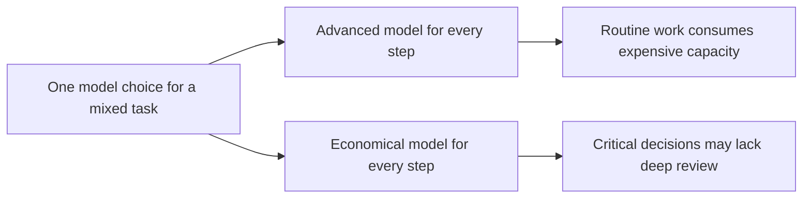
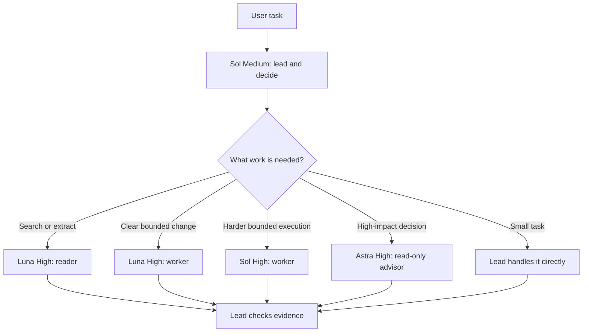
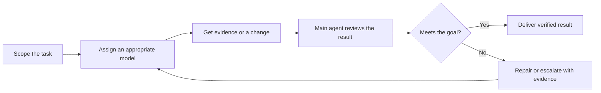

# Codex Agent Collaboration Rules

[English](README.md) · [简体中文](README.zh-CN.md)

**Give each kind of Codex work an appropriate model. Aim to spend much less on routine work while preserving the accuracy of the final result.**

This open-source configuration defines how a main agent routes work to specialist subagents and when it requests deeper analysis. English is the default language. A complete Chinese README and configuration are also available.

> Community project; not an official OpenAI configuration. Named models and roles depend on your Codex environment.

## Pain point: one task contains different kinds of work

A Codex task can involve searching files, making straightforward edits, diagnosing a hard failure, choosing a public API, and verifying the result. Those steps do not need the same reasoning capacity. Using a high-capability model for every step can spend more on routine work. Using only a less costly model may leave a consequential decision without independent deep analysis. Simply adding subagents does not solve the problem if they inherit an unsuitable model or work without clear ownership.



**The economic goal:** spend less on the full task by reserving stronger models for work where their reasoning changes the outcome, while keeping accuracy through review and verification. This is a design goal; the repository does not yet provide measured savings or accuracy benchmarks.

## Solution: route work by difficulty and impact

The main agent normally runs on Sol Medium and owns the user's goal. It handles small tasks directly, sends bounded reading and execution to Luna, uses Sol High for harder bounded execution, and asks Astra High for read-only advice at defined high-impact decision points. The user's explicit model choice always takes precedence.



Astra is triggered before important cross-module architecture, public-interface, or data-model changes; when viable options have material downstream tradeoffs; after two evidence-based repairs fail; or when the user explicitly requests deep review. An applicable prior Astra conclusion is reused rather than requested again without new evidence. Dependent implementation waits for that decision; independent work can proceed.

## How the rules protect accuracy

Saving model capacity only helps if the final answer remains dependable. Each handoff states the goal, constraints, owned files or modules, completion criteria, and evidence to return. Workers can use independent context without inheriting the entire conversation. Astra advises; the main agent makes the decision and checks the actual files and verification evidence. Unavailable roles are reported rather than silently replaced.



For example, on a cross-module API change, Luna maps affected code, Astra compares interface choices, the lead selects a design, workers implement separate parts, and the lead verifies the changes. A small local edit usually stays with the lead. The rules first lived in Codex personalization settings; this repository makes them versioned, inspectable, and open to improvement.

These are workflow preferences; they do not override user instructions, project constraints, permissions, or actual tool availability.

## Files

| File | Purpose |
| --- | --- |
| [`AGENTS.md`](AGENTS.md) | Default English configuration. |
| [`AGENTS.zh-CN.md`](AGENTS.zh-CN.md) | Chinese configuration. |
| [`README.zh-CN.md`](README.zh-CN.md) | Complete Chinese documentation. |
| [`docs/original-config.zh-CN.md`](docs/original-config.zh-CN.md) | Archived original wording. |
| [`assets/codex-personalization-original.png`](assets/codex-personalization-original.png) | Original Codex personalization screenshot. |

The screenshot shows the source rules in Codex's personalization instruction field. The archived text records that source; the two root `AGENTS` files are the reusable versions maintained here.


## Install

Choose **one** language version. An `AGENTS.md` file provides instructions; it does not create custom subagent roles, grant tools, or change a user-selected model. Configure `astra_advisor`, `luna_reader`, `luna_worker`, and `sol_worker` separately if your environment supports them, or adapt the role section to what is actually available.

### Global use

Codex reads `~/.codex/AGENTS.md` as global guidance. If that file exists, back it up and merge the rules you want; do not overwrite existing instructions. Otherwise, from a local clone of this repository:

```bash
mkdir -p ~/.codex
cp AGENTS.md ~/.codex/AGENTS.md
# For Chinese instead: cp AGENTS.zh-CN.md ~/.codex/AGENTS.md
```

If `~/.codex/AGENTS.override.md` exists, it takes priority over the global `AGENTS.md`. Start a new Codex task and ask which instruction files are active to verify the result. See the [official AGENTS.md guide](https://learn.chatgpt.com/docs/agent-configuration/agents-md).

### One repository

Copy the chosen file to the target repository root as `AGENTS.md`. Review an existing file before replacing it, and tailor the rules to that repository. Applicable global guidance may still be loaded.

### Codex personalization

You can paste the chosen configuration into Codex's personalization instruction field, as shown in the screenshot. GitHub changes do **not** automatically update that field or an installed local file. Keep one actively maintained copy per scope to avoid conflicting versions.

## Compatibility

The GPT-6 models and reasoning levels reflect the original author's setup. Availability varies by account, host, and product version; a user-selected main model takes precedence. If the requested advisor is unavailable, the agent should state the actual limitation, continue independent work, and identify any decision that remains blocked. This repository distributes instructions, not executable role definitions or an installer.

## Contributing

Issues and pull requests are welcome. Explain the real case a proposed rule solves and update both `AGENTS.md` and `AGENTS.zh-CN.md` when changing behavior. Keep routine tasks lightweight. The original text and screenshot remain historical source material.

## License

MIT. See [`LICENSE`](LICENSE).
