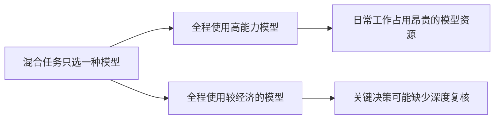
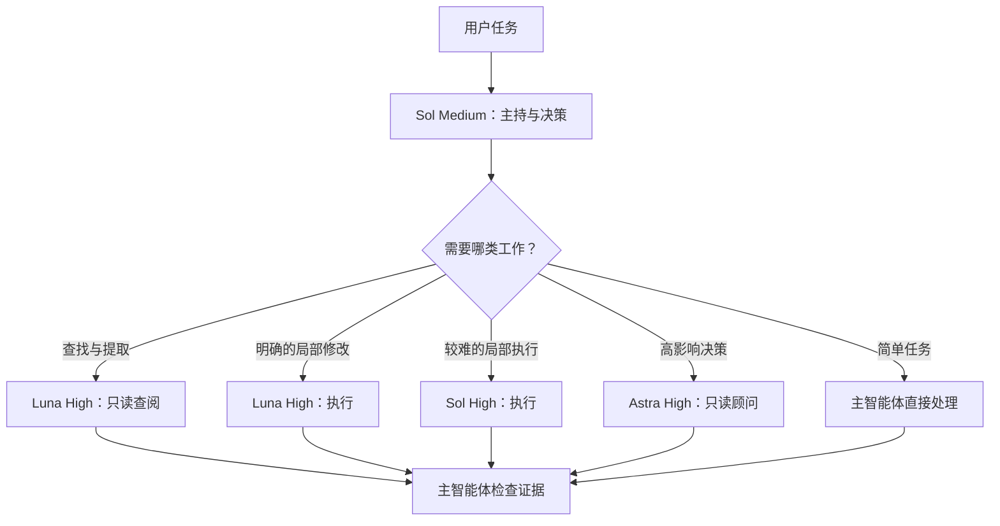
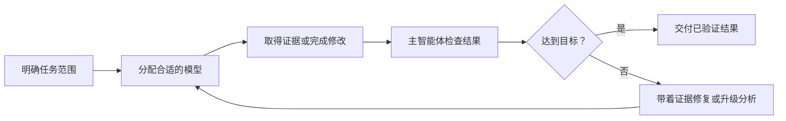
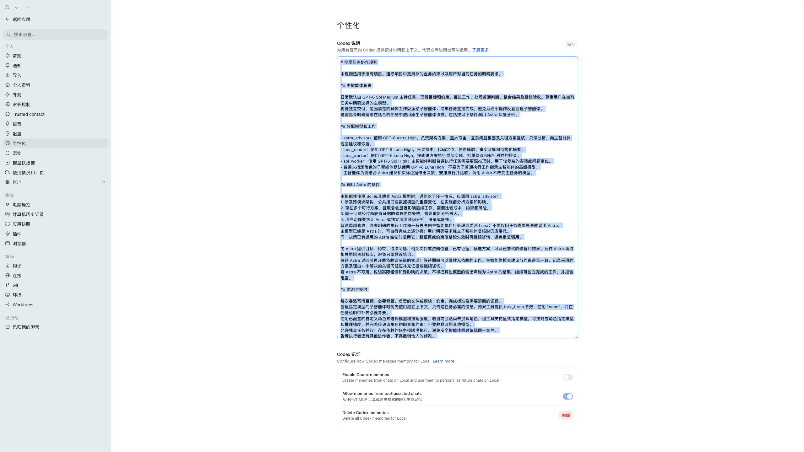

# Codex 智能体协作规则

[English](README.md) · [简体中文](README.zh-CN.md)

**让不同类型的 Codex 工作由合适的模型处理：目标是大幅降低日常工作的费用，同时保持最终结果的准确性。**

这套开源配置规定主智能体如何分配工作、何时请求深度分析。仓库默认展示英文 README，同时提供完整的中文说明和配置。

> 社区项目，并非 OpenAI 官方配置。文中的模型和角色是否可用，取决于你的 Codex 环境。

## 痛点：一个任务包含不同难度的工作

一个 Codex 任务可能同时包含查找文件、明确的局部修改、复杂故障定位、公共接口设计和结果验证。这些步骤需要的推理能力并不相同。全程使用高能力模型，日常工作也会消耗较贵的模型资源；全程使用费用较低的模型，关键决策又可能缺少独立的深度分析。仅仅增加子智能体，也无法解决模型分配不合适、任务归属不清的问题。



**经济目标：** 把更强的模型留给确实影响结果的工作，降低整项任务的费用；同时通过复核和验收保持准确性。这是设计目标，目前仓库尚无实测的费用降幅或准确率数据。

## 方案：按难度和影响分配模型

通常由 Sol Medium 主持任务并对用户目标负责。简单任务直接处理；边界明确的查阅与执行交给 Luna；更难的局部执行交给 Sol High；高影响决策才请 Astra High 做只读分析。用户明确选定的主模型始终优先。



遇到重要的跨模块架构、公共接口或数据模型变化，影响后续工作的方案取舍，两轮有证据的修复失败，或用户明确要求时，才调用 Astra。已有适用的 Astra 结论会复用；依赖该决策的实施要等分析返回，独立工作可以继续。

## 怎样保持结果准确

降低模型消耗的前提是最终结果仍然可靠。每次委派都说明目标、约束、负责文件或模块、完成标准和返回证据。工具支持时，子智能体可使用独立上下文，不必继承整段对话。Astra 提供建议；主智能体作出决策，并检查实际文件和验证证据。角色不可用时如实说明，不悄悄替换。



例如，一个任务需要修改多个模块共用的公共接口：Luna 先定位影响范围，Astra 比较接口方案，主智能体选定设计，执行者分别完成不同部分，最后由主智能体核验改动。简单的局部修改则通常由主智能体直接完成。这套规则最初放在 Codex 个性化设置中；仓库让它可以版本管理、公开审阅和持续改进。

这些是协作偏好，不会覆盖用户要求、项目约束、权限或工具的实际可用性。

## 文件说明

| 文件 | 用途 |
| --- | --- |
| [`AGENTS.md`](AGENTS.md) | 默认英文配置。 |
| [`AGENTS.zh-CN.md`](AGENTS.zh-CN.md) | 中文配置。 |
| [`README.md`](README.md) | 完整英文说明。 |
| [`docs/original-config.zh-CN.md`](docs/original-config.zh-CN.md) | 原始规则文字存档。 |
| [`assets/codex-personalization-original.png`](assets/codex-personalization-original.png) | 最初的 Codex 个性化设置截图。 |

截图展示了放在 Codex 个性化指令输入框中的规则。原文存档用于记录来源；根目录下的两份 `AGENTS` 文件是供其他人使用和持续维护的版本。



## 安装方法

**选择一种语言版本即可。** `AGENTS.md` 只提供指令，不会自动创建自定义子智能体角色、授予工具权限，或改变用户为当前任务选定的模型。如果环境支持，请单独配置 `astra_advisor`、`luna_reader`、`luna_worker`、`sol_worker`；否则调整角色部分，使其符合实际可用的工具。

### 全局使用

Codex 读取 `~/.codex/AGENTS.md` 作为全局规则。如果已有该文件，请先备份并合并需要的规则，不要直接覆盖。否则，在本仓库的本地副本中运行：

```bash
mkdir -p ~/.codex
cp AGENTS.zh-CN.md ~/.codex/AGENTS.md
# 如需英文：cp AGENTS.md ~/.codex/AGENTS.md
```

如果存在 `~/.codex/AGENTS.override.md`，它会优先于全局 `AGENTS.md`。新建 Codex 任务并询问当前生效的指令文件，以检查安装结果。详见 [OpenAI 官方 AGENTS.md 文档](https://learn.chatgpt.com/docs/agent-configuration/agents-md)。

### 只在一个仓库中使用

把所选文件复制到目标仓库根目录，命名为 `AGENTS.md`。覆盖已有文件前先检查内容，并根据项目的实际约束调整。适用的全局规则可能仍会同时加载。

### Codex 个性化设置

也可以像截图那样，把所选配置粘贴到 Codex 个性化指令输入框。GitHub 上的修改**不会自动更新**该输入框或已安装的本地文件。同一作用范围尽量只维护一份生效配置，避免版本冲突。

## 兼容性

文中的 GPT-6 模型和推理强度来自原作者的使用环境。不同账户、主机或产品版本的可用能力可能不同；用户选定的主模型优先。如果顾问角色不可用，智能体应说明实际限制，继续可独立完成的工作，并指出仍被阻塞的决策。本仓库发布的是指令，不包含可执行的角色定义或安装器。

## 参与贡献

欢迎提交 Issue 和 Pull Request。提出新规则时，请说明它解决的真实场景；改变规则行为时，同步更新 `AGENTS.md` 和 `AGENTS.zh-CN.md`。简单任务应保持轻量。原文和截图作为历史资料保留。

## 许可证

MIT，见 [`LICENSE`](LICENSE)。
